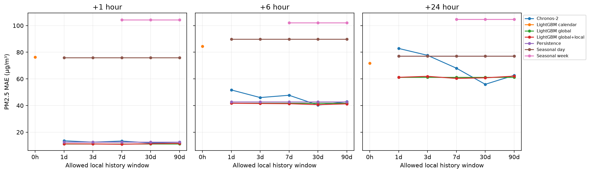

# Milestone 1 — measured

UCI data downloaded, pinned and verified: 12 stations, 420,768 rows, no duplicate timestamps or hourly discontinuities. See DATASET.md and PROTOCOL.md.

Initial holdout: Aotizhongxin. Test interval September 2016–February 2017. 140 common forecast origins; +1/+6/+24-hour targets. Other 11 stations supply LightGBM fitting data. All results below are executed predictions, not examples. PM2.5 errors are µg/m³.

| Model                 |   History h |   H1 MAE |   H6 MAE |   H24 MAE |   High-PM MAE |   Fit sec |   Infer sec |
|:----------------------|------------:|---------:|---------:|----------:|--------------:|----------:|------------:|
| Chronos-2             |          24 |    13.55 |    51.70 |     82.85 |         72.60 |      0.00 |        0.81 |
| Chronos-2             |          72 |    12.51 |    46.00 |     77.68 |         71.39 |      0.00 |        0.27 |
| Chronos-2             |         168 |    13.35 |    47.71 |     68.04 |         86.74 |      0.00 |        0.32 |
| Chronos-2             |         720 |    11.88 |    40.33 |     55.94 |         72.37 |      0.00 |        0.36 |
| Chronos-2             |        2160 |    12.51 |    42.90 |     62.69 |         75.17 |      0.00 |        0.93 |
| LightGBM calendar     |           0 |    76.36 |    84.38 |     71.69 |        162.50 |      0.70 |        0.01 |
| LightGBM global       |          24 |    11.28 |    41.72 |     61.19 |         65.66 |      2.21 |        0.01 |
| LightGBM global       |          72 |    11.28 |    41.72 |     61.19 |         65.66 |      0.00 |        0.00 |
| LightGBM global       |         168 |    11.28 |    41.72 |     61.19 |         65.66 |      0.00 |        0.00 |
| LightGBM global       |         720 |    11.28 |    41.72 |     61.19 |         65.66 |      0.00 |        0.00 |
| LightGBM global       |        2160 |    11.28 |    41.72 |     61.19 |         65.66 |      0.00 |        0.00 |
| LightGBM global+local |          24 |    11.28 |    41.72 |     61.19 |         65.66 |      0.00 |        0.00 |
| LightGBM global+local |          72 |    11.19 |    41.51 |     61.93 |         66.62 |      2.37 |        0.01 |
| LightGBM global+local |         168 |    10.96 |    41.39 |     60.36 |         64.85 |      2.52 |        0.00 |
| LightGBM global+local |         720 |    11.36 |    40.69 |     60.82 |         65.39 |      2.57 |        0.01 |
| LightGBM global+local |        2160 |    11.60 |    41.25 |     62.07 |         66.35 |      2.57 |        0.01 |
| Persistence           |          24 |    12.59 |    42.86 |     77.19 |         65.62 |      0.00 |        0.00 |
| Persistence           |          72 |    12.59 |    42.86 |     77.19 |         65.62 |      0.00 |        0.00 |
| Persistence           |         168 |    12.59 |    42.86 |     77.19 |         65.62 |      0.00 |        0.00 |
| Persistence           |         720 |    12.59 |    42.86 |     77.19 |         65.62 |      0.00 |        0.00 |
| Persistence           |        2160 |    12.59 |    42.86 |     77.19 |         65.62 |      0.00 |        0.00 |
| Seasonal day          |          24 |    75.94 |    89.79 |     77.19 |        117.43 |      0.00 |        0.00 |
| Seasonal day          |          72 |    75.94 |    89.79 |     77.19 |        117.43 |      0.00 |        0.00 |
| Seasonal day          |         168 |    75.94 |    89.79 |     77.19 |        117.43 |      0.00 |        0.00 |
| Seasonal day          |         720 |    75.94 |    89.79 |     77.19 |        117.43 |      0.00 |        0.00 |
| Seasonal day          |        2160 |    75.94 |    89.79 |     77.19 |        117.43 |      0.00 |        0.00 |
| Seasonal week         |         168 |   104.25 |   102.16 |    104.71 |        182.77 |      0.00 |        0.00 |
| Seasonal week         |         720 |   104.25 |   102.16 |    104.71 |        182.77 |      0.00 |        0.00 |
| Seasonal week         |        2160 |   104.25 |   102.16 |    104.71 |        182.77 |      0.00 |        0.00 |

0h is a separately labeled donor-trained calendar model; Chronos, persistence and seasonal forecasts require observations. Global+local has zero fitting rows at 24h and therefore equals global. Chronos remains zero-shot task adaptation at every positive context budget. Positive-budget global and short-lag baselines plateau by construction.

Times are exclusive measured fit/inference costs; reused models and predictions have zero incremental cost. Chronos produces all horizons in one call, charged to H1 in raw costs. Download, startup and features excluded. Full MAE/RMSE/MASE, per-origin predictions, cost rows and exclusion flags are in results/. No model or protocol selection follows these test results.
