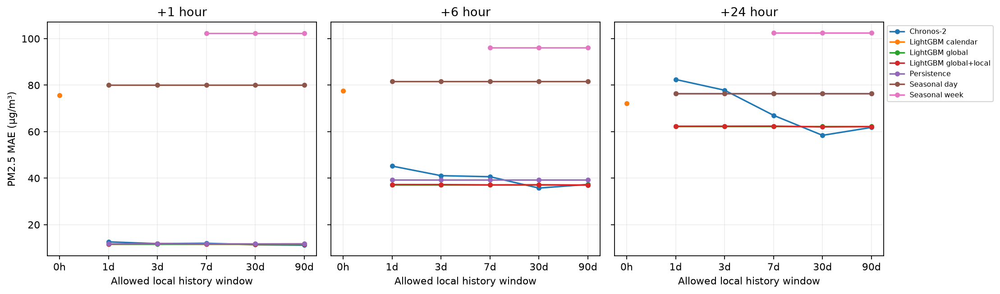
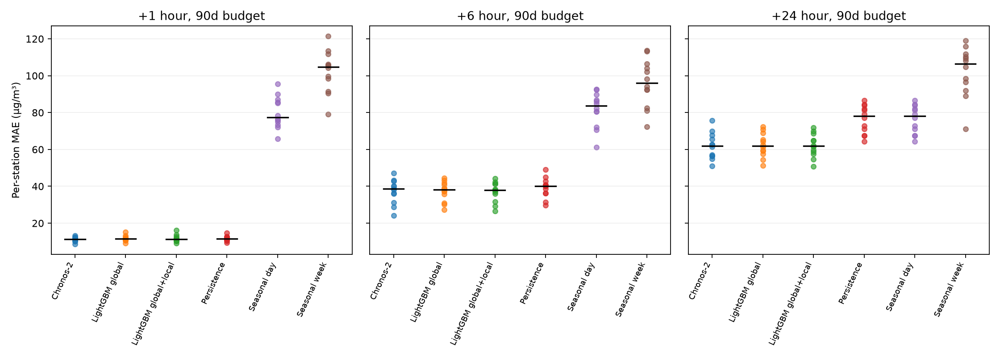

# ColdStartAQ measured results

All 12 station holdouts completed under the frozen protocol. **1596 retained station-origin pairs** from 2076 candidates, each scored at 1, 6 and 24 hours. PM2.5 errors are µg/m³.

## Accuracy and cost

| Model                 |   History h |   H1 MAE |   H6 MAE |   H24 MAE |   High-PM MAE |   Fit sec |   Infer sec |
|:----------------------|------------:|---------:|---------:|----------:|--------------:|----------:|------------:|
| Chronos-2             |          24 |    12.62 |    45.21 |     82.46 |         77.66 |      0.00 |        5.85 |
| Chronos-2             |          72 |    11.82 |    41.08 |     77.83 |         73.37 |      0.00 |        2.72 |
| Chronos-2             |         168 |    12.00 |    40.63 |     67.03 |         81.89 |      0.00 |        2.75 |
| Chronos-2             |         720 |    11.36 |    35.74 |     58.43 |         70.63 |      0.00 |        4.03 |
| Chronos-2             |        2160 |    11.20 |    37.31 |     61.83 |         71.16 |      0.00 |       10.38 |
| LightGBM calendar     |           0 |    75.59 |    77.61 |     72.17 |        164.71 |      8.14 |        0.06 |
| LightGBM global       |          24 |    11.68 |    37.25 |     62.33 |         70.62 |     25.71 |        0.06 |
| LightGBM global       |          72 |    11.68 |    37.25 |     62.33 |         70.62 |      0.00 |        0.00 |
| LightGBM global       |         168 |    11.68 |    37.25 |     62.33 |         70.62 |      0.00 |        0.00 |
| LightGBM global       |         720 |    11.68 |    37.25 |     62.33 |         70.62 |      0.00 |        0.00 |
| LightGBM global       |        2160 |    11.68 |    37.25 |     62.33 |         70.62 |      0.00 |        0.00 |
| LightGBM global+local |          24 |    11.68 |    37.25 |     62.33 |         70.62 |      0.00 |        0.00 |
| LightGBM global+local |          72 |    11.80 |    37.24 |     62.35 |         71.51 |     26.11 |        0.06 |
| LightGBM global+local |         168 |    11.70 |    37.10 |     62.38 |         71.19 |     25.48 |        0.06 |
| LightGBM global+local |         720 |    11.70 |    37.16 |     62.05 |         70.57 |     25.66 |        0.06 |
| LightGBM global+local |        2160 |    11.73 |    37.01 |     62.17 |         70.63 |     25.78 |        0.06 |
| Persistence           |          24 |    11.75 |    39.30 |     76.44 |         66.97 |      0.00 |        0.00 |
| Persistence           |          72 |    11.75 |    39.30 |     76.44 |         66.97 |      0.00 |        0.00 |
| Persistence           |         168 |    11.75 |    39.30 |     76.44 |         66.97 |      0.00 |        0.00 |
| Persistence           |         720 |    11.75 |    39.30 |     76.44 |         66.97 |      0.00 |        0.00 |
| Persistence           |        2160 |    11.75 |    39.30 |     76.44 |         66.97 |      0.00 |        0.00 |
| Seasonal day          |          24 |    80.00 |    81.59 |     76.44 |        122.30 |      0.00 |        0.00 |
| Seasonal day          |          72 |    80.00 |    81.59 |     76.44 |        122.30 |      0.00 |        0.00 |
| Seasonal day          |         168 |    80.00 |    81.59 |     76.44 |        122.30 |      0.00 |        0.00 |
| Seasonal day          |         720 |    80.00 |    81.59 |     76.44 |        122.30 |      0.00 |        0.00 |
| Seasonal day          |        2160 |    80.00 |    81.59 |     76.44 |        122.30 |      0.00 |        0.00 |
| Seasonal week         |         168 |   102.42 |    96.18 |    102.53 |        183.54 |      0.00 |        0.00 |
| Seasonal week         |         720 |   102.42 |    96.18 |    102.53 |        183.54 |      0.00 |        0.00 |
| Seasonal week         |        2160 |   102.42 |    96.18 |    102.53 |        183.54 |      0.00 |        0.00 |

High-PM MAE combines the three horizons, weighting qualifying targets equally. Threshold: observed PM2.5 >168 µg/m³, the development-only pooled 90th percentile. Horizon-specific high errors and bias are in metrics.csv. No health interpretation is intended.

## History to within 10% of mature performance

| model                 |   horizon |   threshold_hours |   mature_mae |
|:----------------------|----------:|------------------:|-------------:|
| Chronos-2             |         1 |                72 |        11.20 |
| Chronos-2             |         6 |               168 |        37.31 |
| Chronos-2             |        24 |               168 |        61.83 |
| LightGBM global       |         1 |                24 |        11.68 |
| LightGBM global       |         6 |                24 |        37.25 |
| LightGBM global       |        24 |                24 |        62.33 |
| LightGBM global+local |         1 |                24 |        11.73 |
| LightGBM global+local |         6 |                24 |        37.01 |
| LightGBM global+local |        24 |                24 |        62.17 |
| Persistence           |         1 |                24 |        11.75 |
| Persistence           |         6 |                24 |        39.30 |
| Persistence           |        24 |                24 |        76.44 |
| Seasonal day          |         1 |                24 |        80.00 |
| Seasonal day          |         6 |                24 |        81.59 |
| Seasonal day          |        24 |                24 |        76.44 |
| Seasonal week         |         1 |               168 |       102.42 |
| Seasonal week         |         6 |               168 |        96.18 |
| Seasonal week         |        24 |               168 |       102.53 |

Earliest budget with all larger supported budgets also within 10% of its own 90d MAE; not a cross-model usefulness threshold. Per-station thresholds are in station_history_threshold.csv.

## Probabilistic performance (Chronos only)

|   history_hours |   horizon |   overall_pinball |   overall_coverage80 |   overall_width80 |   high_pinball |   high_coverage80 |   high_width80 |
|----------------:|----------:|------------------:|---------------------:|------------------:|---------------:|------------------:|---------------:|
|          24.000 |     1.000 |             4.401 |                0.803 |            48.705 |          8.032 |             0.860 |         99.271 |
|          24.000 |     6.000 |            16.042 |                0.653 |           114.742 |         24.174 |             0.747 |        232.638 |
|          24.000 |    24.000 |            30.143 |                0.498 |           216.849 |         52.833 |             0.507 |        518.258 |
|          72.000 |     1.000 |             4.070 |                0.791 |            40.083 |          7.291 |             0.848 |         78.113 |
|          72.000 |     6.000 |            14.041 |                0.692 |           103.849 |         22.666 |             0.698 |        196.920 |
|          72.000 |    24.000 |            25.391 |                0.579 |           181.260 |         41.771 |             0.570 |        271.358 |
|         168.000 |     1.000 |             4.075 |                0.784 |            39.100 |          7.326 |             0.872 |         81.967 |
|         168.000 |     6.000 |            13.057 |                0.702 |           106.040 |         24.613 |             0.738 |        216.947 |
|         168.000 |    24.000 |            21.400 |                0.655 |           157.169 |         46.199 |             0.559 |        238.479 |
|         720.000 |     1.000 |             3.924 |                0.758 |            37.502 |          7.179 |             0.838 |         77.867 |
|         720.000 |     6.000 |            11.579 |                0.734 |           102.474 |         23.107 |             0.735 |        202.739 |
|         720.000 |    24.000 |            17.940 |                0.677 |           157.535 |         35.851 |             0.596 |        240.050 |
|        2160.000 |     1.000 |             3.915 |                0.760 |            35.455 |          6.806 |             0.829 |         67.806 |
|        2160.000 |     6.000 |            12.400 |                0.725 |           104.802 |         23.245 |             0.719 |        199.020 |
|        2160.000 |    24.000 |            18.942 |                0.664 |           169.943 |         37.303 |             0.542 |        243.432 |

Intervals target 80% coverage. Pinball averages quantiles .1/.5/.9. High-event calibration is conditional on observed extremes, so it need not equal marginal 80% even for a marginally calibrated forecaster. Deterministic baselines have no comparable intervals.

## Coverage and uncertainty

| station       |   candidates |   retained |
|:--------------|-------------:|-----------:|
| Aotizhongxin  |          173 |        140 |
| Changping     |          173 |        147 |
| Dingling      |          173 |        105 |
| Dongsi        |          173 |        122 |
| Guanyuan      |          173 |        131 |
| Gucheng       |          173 |        128 |
| Huairou       |          173 |        137 |
| Nongzhanguan  |          173 |        132 |
| Shunyi        |          173 |        119 |
| Tiantan       |          173 |        143 |
| Wanliu        |          173 |        147 |
| Wanshouxigong |          173 |        145 |

Station-level MAE/RMSE/MASE and bias: station_metrics.csv; individual station curves: results/figures/adaptation_STATION.png. metrics.csv contains 95% paired station-cluster bootstrap intervals and paired MAE differences against persistence (2000 replicates). Resampling whole stations preserves serial dependence. Correlated citywide shocks and only 12 stations limit interval interpretation. Complete-history eligibility and sparse 25-hour sampling limit generalization to outages or every hourly issuance.

## Efficiency

GPU: NVIDIA GeForce RTX 3060; CPU: Intel64 Family 6 Model 151 Stepping 2, GenuineIntel; four CPU threads. Chronos has 119,477,664 frozen parameters. No API fees. costs.csv reports actual donor/local sample counts, tree leaf counts and exclusive fit/inference times. Cumulative process peak CUDA allocation at station completion is in each complete.json; these are not independent station peaks. Model load timing and package versions: hardware.json. Local fitting samples can be fewer than the nominal clock-hour budget due to horizon/feature boundaries and missingness. Tree leaf counts are not directly comparable to neural parameter counts.

## Interpretation and limitations

The experiment compares **history-window budgets**, not the time required after a single sensor deployment. LightGBM global+local uses a frozen pre-test H-hour fitting window and rolling 24-hour inference context; Chronos uses a rolling H-hour context with no fitting. Thus the models consume different kinds of history and do not have equal total acquisition budgets. A plateau in the global/naive curves reflects their fixed feature footprints. H=0 has only the donor-trained calendar reference; a context-free Chronos forecast is N/A.

These are zero-shot task-adaptation measurements, not a guarantee Beijing was absent from pretraining. No claim of novelty for air-quality forecasting, station holdout, uncertainty, or chronological evaluation. Only one TSFM and one fixed LightGBM specification were tested. There is no test tuning or optional masking study.

## Error inspection

Top 20 absolute errors for each mature model: worst_cases.csv. Tags are overlapping observed-variable descriptions (rapid rises/falls, high targets, wind changes, weather changes, long historical gaps, lag-like predictions). They do not establish atmospheric causation. Negative bias means underprediction. The report's companion FINDINGS.md summarizes measured comparisons and these cases.

## Mature-budget confidence intervals

| model                 |   horizon |   mae |   mae_ci_low |   mae_ci_high |   delta_vs_persistence |   delta_ci_low |   delta_ci_high |
|:----------------------|----------:|------:|-------------:|--------------:|-----------------------:|---------------:|----------------:|
| Chronos-2             |         1 | 11.20 |        10.50 |         11.82 |                  -0.55 |          -0.91 |           -0.21 |
| Chronos-2             |         6 | 37.31 |        33.66 |         40.58 |                  -1.99 |          -3.12 |           -1.01 |
| Chronos-2             |        24 | 61.83 |        58.30 |         65.63 |                 -14.61 |         -16.32 |          -12.95 |
| LightGBM global       |         1 | 11.68 |        10.86 |         12.55 |                  -0.07 |          -0.42 |            0.26 |
| LightGBM global       |         6 | 37.25 |        34.21 |         39.92 |                  -2.05 |          -2.99 |           -1.25 |
| LightGBM global       |        24 | 62.33 |        59.18 |         65.53 |                 -14.11 |         -16.36 |          -11.95 |
| LightGBM global+local |         1 | 11.73 |        10.81 |         12.76 |                  -0.02 |          -0.38 |            0.39 |
| LightGBM global+local |         6 | 37.01 |        33.91 |         39.57 |                  -2.29 |          -3.17 |           -1.39 |
| LightGBM global+local |        24 | 62.17 |        59.03 |         65.31 |                 -14.27 |         -16.47 |          -12.18 |
| Persistence           |         1 | 11.75 |        10.98 |         12.54 |                   0.00 |           0.00 |            0.00 |
| Persistence           |         6 | 39.30 |        36.41 |         42.02 |                   0.00 |           0.00 |            0.00 |
| Persistence           |        24 | 76.44 |        72.31 |         80.36 |                   0.00 |           0.00 |            0.00 |

Negative paired delta favors the named model over persistence.

Quantile ordering: 5 of 191,520 generated trajectory steps required endpoint correction. The median was preserved; see [amendment](PROTOCOL_AMENDMENT.md). All reported intervals and pinball scores use corrected endpoints.
